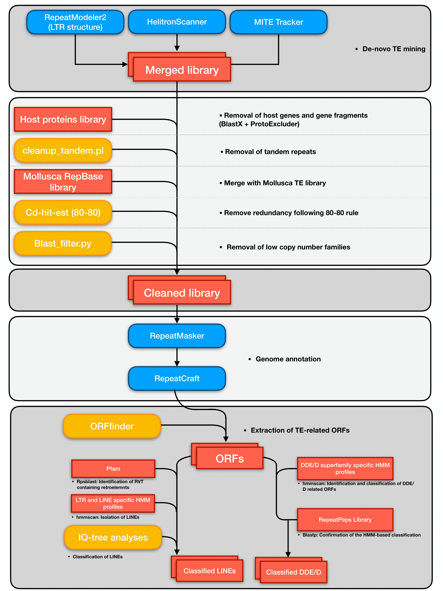

# EvoTEs_BiV
Pipeline used to characterize transposable elements in 39 molluscan genomes. For any question feel free to contact me at jacopo.martelossi2@unibo.it

### Pipeline

### Data

**DDE_D.hmm**: HMM profiles databse of DDE/D transposases builded up from sequences from [Yuan and Wessler, (2011)](https://www.pnas.org/doi/10.1073/pnas.1104208108#ref-36). Used in script [07.DDE_D_ORFs_Identification.sh](https://github.com/jacopoM28/EvoTEs_BiV-/blob/main/07.DDE_D_ORFs_Identification.sh).  
**RVT_MolluscaPfam.hmm**: HMM profiles database describing LINEs and LTRs derived RVTs. Used in script [05.LINEs_Identification.sh](https://github.com/jacopoM28/EvoTEs_BiV-/blob/main/05.LINEs_Identification.sh).  
**NJ-SupFam_costrain.txt**: Tree file in newick format rapresenting the superfamilies relanthionships obtained with Neighbor-Joining analyses. Used in script [08.LINEs_Phylogenetic_Analyses.sh](https://github.com/jacopoM28/EvoTEs_BiV-/blob/main/08.LINEs_Phylogenetic_Analyses.sh)
